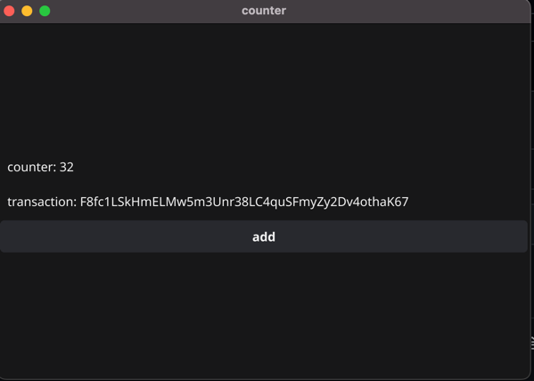

# Fyne Sui dApp 模板

这是一个使用 Fyne 框架在 Sui 区块链上构建去中心化应用 (dApp) 的模板项目。它演示了如何创建一个与 Sui 智能合约交互的跨平台应用（桌面、Web 和移动端）。

英文版说明请参见 [README.md](./README.md)。

## ✨ 特性

- **跨平台**: 基于 Fyne 构建，一份代码库即可支持桌面端（Windows, macOS, Linux）、Web端（通过 WebAssembly）和移动端（iOS, Android）。
- **Sui 集成**: 演示了如何使用 `sui-go-sdk` 与 Sui 区块链进行交互。
- **简单的计数器 dApp**: 一个直观的计数器应用示例，其状态在 Sui 区块链上存储和修改。
- **开箱即用**: 作为您在 Sui 上构建更复杂 dApp 的绝佳起点。

## 🛠️ 技术栈

- **前端/UI**: [Go](https://golang.org/) 配合 [Fyne](https://fyne.io/)
- **区块链**: [Sui](https://sui.io/)
- **智能合约语言**: [Move](https://move-language.github.io/move/)
- **Sui SDK**: [sui-go-sdk](https://github.com/block-vision/sui-go-sdk)

## 🚀 如何开始

### 环境准备

- **Go**: 确保您已安装 Go 1.18 或更高版本。
- **Fyne 依赖**: 遵循 [Fyne 安装指南](https://developer.fyne.io/started/) 为您的操作系统设置必要的图形驱动和工具。

### 1. 克隆仓库

```bash
git clone https://github.com/pwh-pwh/sui-go-dapp
cd counter
```

### 2. 配置您的私钥

您需要一个 Sui 账户来签署交易。

1.  打开 `myconfig.go` 文件。
2.  将占位符 `"your private key"` 替换为您真实的 Sui 账户私钥（经过 base64 编码）。

    ```go
    // myconfig.go
    package main

    const (
    	PriKey = "在这里填入你的SUI私钥" // 例如: "privkey:..."
    )
    ```

    **安全提示**: 请务必妥善保管您的私钥。对于真实的应用，请使用更安全的方式来管理密钥，例如环境变量或专用的密钥管理服务。

### 3. 运行应用

在您的桌面上运行此应用：

```bash
go run .
```

### 4. 为不同平台构建

您可以使用 `fyne` 命令行工具为不同平台打包您的应用。

- **桌面端**:
  ```bash
  fyne package
  ```
- **Web 端 (WebAssembly)**:
  ```bash
  fyne package -os wasm
  ```
- **移动端 (Android)**:
  ```bash
  fyne package -os android
  ```

## 📄 智能合约

智能合约位于 `contract/sources/counter.move`。这是一个简单的 Move 模块，定义了一个 `Counter` 对象。

- **`Counter` 结构体**: 包含一个 `u8` 类型的 `counter` 字段。
- **`init` 函数**: 创建初始的 `Counter` 对象并将其作为共享对象发布到网络上。
- **`increment` 函数**: 一个入口函数，用于将 `counter` 的值加 1。

该应用与部署在 Sui 测试网上的此合约的预部署版本进行交互。`PackageId` 和 `CountObjId` 已在 `main.go` 中硬编码。
## 🖼️ 截图

以下是应用在不同平台上的外观：

### 桌面端



### 浏览器端


### 移动端

