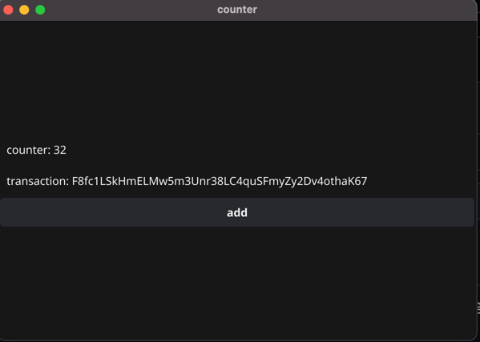
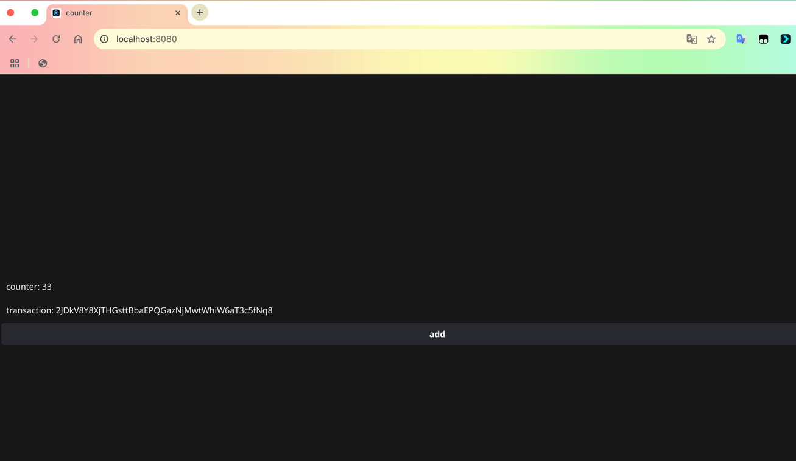
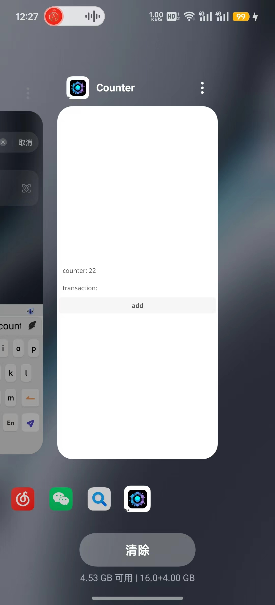

# Fyne Sui dApp Template

This is a template project for building decentralized applications (dApps) on the Sui blockchain using the Fyne framework. It demonstrates how to create a cross-platform application (desktop, web, and mobile) that interacts with a Sui smart contract.

A Chinese version of the README is available at [README-zh.md](./README-zh.md).

## ✨ Features

- **Cross-Platform**: Built with Fyne, it supports desktop (Windows, macOS, Linux), web (via WebAssembly), and mobile (iOS, Android) from a single codebase.
- **Sui Integration**: Demonstrates how to interact with the Sui blockchain using the `sui-go-sdk`.
- **Simple Counter dApp**: A straightforward example of a counter application where the state is stored and modified on the Sui blockchain.
- **Ready to Use**: A great starting point for building your own complex dApps on Sui.

## 🛠️ Tech Stack

- **Frontend/UI**: [Go](https://golang.org/) with [Fyne](https://fyne.io/)
- **Blockchain**: [Sui](https://sui.io/)
- **Smart Contract Language**: [Move](https://move-language.github.io/move/)
- **Sui SDK**: [sui-go-sdk](https://github.com/block-vision/sui-go-sdk)

## 🚀 Getting Started

### Prerequisites

- **Go**: Make sure you have Go 1.18 or later installed.
- **Fyne Dependencies**: Follow the [Fyne installation guide](https://developer.fyne.io/started/) to set up the necessary graphics drivers and tools for your operating system.

### 1. Clone the Repository

```bash
git clone https://github.com/pwh-pwh/sui-go-dapp
cd counter
```

### 2. Configure Your Private Key

You need a Sui account to sign transactions.

1.  Open the `myconfig.go` file.
2.  Replace the placeholder `"your private key"` with your actual Sui account's base64 encoded private key.

    ```go
    // myconfig.go
    package main

    const (
    	PriKey = "YOUR_SUI_PRIVATE_KEY_HERE" // e.g., "privkey:..."
    )
    ```

    **Security Note**: Be extremely careful with your private key. For a real application, use a more secure method for key management, such as environment variables or a dedicated secrets manager.

### 3. Run the Application

To run the application on your desktop:

```bash
go run .
```

### 4. Build for Different Platforms

You can use the `fyne` command-line tool to package your application for different platforms.

- **Desktop**:
  ```bash
  fyne package
  ```
- **Web (WebAssembly)**:
  ```bash
  fyne package -os wasm
  ```
- **Mobile (Android)**:
  ```bash
  fyne package -os android
  ```

## 📄 Smart Contract

The smart contract is located in `contract/sources/counter.move`. It's a simple Move module that defines a `Counter` object.

- **`Counter` struct**: Holds a single `counter` field of type `u8`.
- **`init` function**: Creates the initial `Counter` object and shares it on the network.
- **`increment` function**: An entry function that increments the `counter` value by 1.

The application interacts with a pre-deployed version of this contract on the Sui Testnet. The `PackageId` and `CountObjId` are hardcoded in `main.go`.
## 🖼️ Screenshots

Here's what the application looks like on different platforms:

### Desktop



### Web Browser



### Mobile Device

